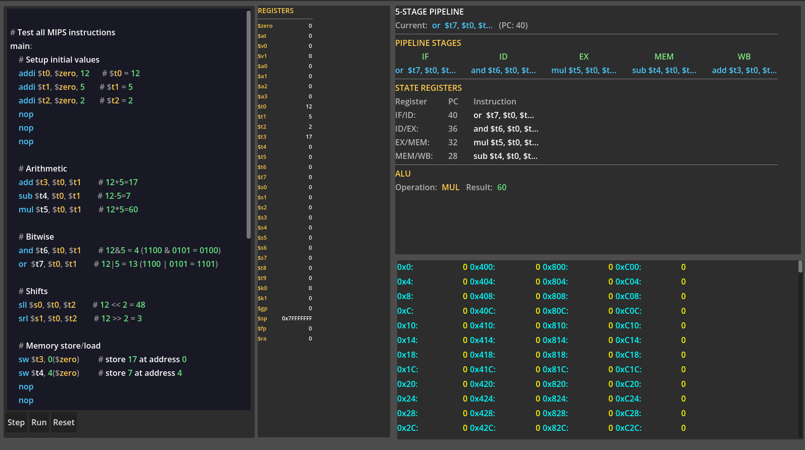

# MIPS 5-Stage Pipelined Simulator

A cycle-accurate simulator of a 5-stage pipelined MIPS processor built with Godot Engine 4.6.2 (GDScript). The simulator loads an assembly program and executes it step-by-step through the classic IF-ID-EX-MEM-WB pipeline, displaying the state of registers, memory, and pipeline stages after each cycle.

## Features

- 5-stage pipeline with explicit pipeline registers (IF/ID, ID/EX, EX/MEM, MEM/WB)
- Supports ADD, ADDI, SUB, MUL, AND, OR, SLL, SRL, LW, SW, BEQ, J, NOP
- Visual pipeline diagram showing which instruction is in each stage
- State registers display PC and instruction/content of IF/ID, ID/EX, EX/MEM, MEM/WB
- Register file with all 32 MIPS registers shown in decimal and hex
- 4KB data memory displayed in a scrollable panel
- Step (one cycle), Run (auto-execute with adjustable speed), and Reset controls
- Syntax highlighting for MIPS assembly inside the built-in editor

## Project Structure

- cpu.gd - Core pipeline logic, control unit, ALU, register file, memory
- control_panel.gd - Step/Run/Reset buttons and speed slider
- register_panel.gd - Display of 32 registers
- pipeline_panel.gd - Pipeline stages and state registers visualization
- memory_panel.gd - Scrollable data memory display
- scene.tscn - Main scene with all nodes arranged

## How to Build and Run

Prerequisites: Godot Engine 4.6.2 or later. No external libraries required.

1. Clone the repository: git clone https://github.com/yourusername/mips-pipeline-simulator.git
2. Open the project in Godot by importing the project.godot file
3. Press F5 to run the simulator
4. Type or paste MIPS assembly code into the CodeEdit panel
5. Press Step to execute one pipeline cycle at a time
6. Press Run to execute continuously (use the speed slider to adjust delay)
7. Press Reset to clear registers, memory, and pipeline

## Example Program

main:
    addi $t0, $zero, 12
    addi $t1, $zero, 5
    addi $t2, $zero, 2
    nop
    nop
    nop
    add $t3, $t0, $t1      # 12+5 = 17
    sub $t4, $t0, $t1      # 12-5 = 7
    mul $t5, $t0, $t1      # 12*5 = 60
    and $t6, $t0, $t1      # 12&5 = 4
    or $t7, $t0, $t1       # 12|5 = 13
    sll $s0, $t0, $t2      # 12 << 2 = 48
    srl $s1, $t0, $t2      # 12 >> 2 = 3
    sw $t3, 0($zero)       # store 17 at address 0
    sw $t4, 4($zero)       # store 7 at address 4
    nop
    nop
    nop
    lw $s2, 0($zero)       # load 17 into $s2
    lw $s3, 4($zero)       # load 7 into $s3
    beq $s2, $s3, 2        # not taken (17 != 7)
    addi $s4, $zero, 999   # executed
    addi $s5, $zero, 888   # executed
    j end
    addi $s6, $zero, 666   # skipped
end:
    sw $s4, 8($zero)       # store 999 at address 8

## Implementation Notes

The simulator uses explicit state registers between each stage: if_id, id_ex, ex_mem, mem_wb. Each holds instruction text, PC, decoded values, and control signals.

The control unit is implemented in the ID stage via generate_control_signals(). It produces reg_write, reg_dst, alu_src, mem_read, mem_write, mem_to_reg, branch, jump, and alu_op. ALU operation is selected in the EX stage using the alu_op signal.

The register file is a dictionary with 32 entries, read in ID stage and written in WB stage. $zero is hardwired to 0. Data memory is 4096 bytes (4KB), initialized to zero, accessed only in MEM stage for lw/sw.

The simulator does not implement forwarding or stalling. The programmer must insert NOP instructions to avoid data hazards (allowed by project requirements). Control hazards are handled by flushing the pipeline when a branch is taken or a jump is executed.

## Debug Mode

Set debug_mode = true in cpu.gd to enable console output showing every cycle's stage operations, register values, pipeline state register contents, ALU results, and memory operations.

## Possible Extensions

Add forwarding unit, branch prediction, graphical datapath diagram, or support for additional instructions like slt, slti, jal, jr.

